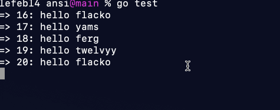

# Go Scroll Buffer

ANSI Scroll Buffer Stages is a simple package meant to emulate the stages in a
cli tool where overall output isn't important unless there is a failure. It
consists of a simple buffer abstraction that utilizes ANSI escape codes in the
background. This can help when there is a large amount of output to the terminal
in stages, but the overall result may be important to communicate to the user.



## Install

```bash
go get github.com/louislef299/scroll
```

## Examples

Simple write to the Buffer:

```go
scroll.Printf("hello world")
```

Erase the existing Buffer:

```go
// Prints hello world 5x
for i := 0; i < 5; i++ {
    scroll.Printf("hello world")
}
scroll.EraseBuffer()
```

Run print statements in stages:

```go
// Stage 1
for i := 0; i < 5; i++ {
    scroll.Printf("%d: hello from stage 1", i + 1)
}
// end stage
scroll.NewStage("stage 1 complete!")

// Stage 2
for i := 0; i < 5; i++ {
    scroll.Printf("%d: hello from stage 2", i + 1)
}
// end stage
scroll.NewStage("stage 2 complete!")
```

Create a custom Buffer:

```go
// Creates a new buffer with a size of 5
buff := New(context.TODO(), os.Stdout, 5)

// Prints hello world 5x
for i := 0; i < 5; i++ {
    buff.Printf("hello world")
}
time.Sleep(time.Second)
buff.NewStage("finish buffer example!")
```

The ANSI Buffer also implements io.Writer:

```go
log.SetOutput(New(context.TODO(), 5))
log.Println("written from test")
```

The writer is unreliable under stress however, as the channels that are created
for synchronization are not reliably transferred to packages like log and fmt.

## Contributing

The tests are currently visual tests and require a human to watch the output and
verify functionality. Not ideal, but that's how it is for now. Feel free to fix
it!

### Known Issues

- If the line sent to the buffer is longer than the width of the terminal, the
  number of lines deleted is incorrect.

## References

The scroll package takes some inspiration for the [log standard package][] and
[Fatih Arslan's color package][].

[Fatih Arslan's color package]: https://github.com/fatih/color
[log standard package]: https://cs.opensource.google/go/go/+/master:src/log/
